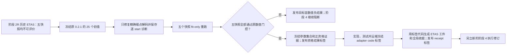

# 阶段 2 ETAS 数值修复预登记协议

## 1. 结论先行

本协议建立独立的 `0.2.2` 目标盲修复路线，只解决阶段 2R 中 ETAS 参数变换和审计证据缺口。它不重写阶段 2/2R 的历史结论，不调用阶段 4 正式目标消费者、不构造阶段 4 assessment cohort，不计算信息增益，不创建 `Score ID`，也不运行阶段 9 锁定测试。

原始协议冻结标签 `v0.2.2-background-etas-repair-protocol` 保持不可变。代码实现前审计发现其科学输入整数通则把固定网格 `row/column` 误写为非负，而既有冻结网格 ID 和索引公式明确使用有符号行列号；勘误标签为 `v0.2.2-background-etas-repair-protocol-r1`。R1 只把 `ordered_quadrature_containers.cells.row/column` 明确为拒绝 bool 的严格有符号 base-10 整数，其他计数、起点索引和优化器整数仍严格非负，不改变任何事件、几何、网格、KDE、初值、目标、门限或拟合规则。R1 标签已完成测试、验收、提交、推送和远端核验；只有修复代码标签完成远端冻结后，才允许打开阶段 2 目录源、生成或检查真实 fit-only 输入包。正式资格无论得到 `evaluable` 还是 `not_evaluable`，都必须用同一个预登记结果标签冻结，负结果不能只停留在普通提交中。当前发布顺序严格为：原协议标签 → R1 协议标签 → R2 协议标签 → R3 协议标签 → 修复代码标签 → 正/负资格结果标签；只有正资格结果标签已提交、推送并远端核验，才允许实现适配器。随后先冻结只含适配器源码、测试及资格绑定的 `v0.2.2-background-etas-comparator-adapter`，远端核验该代码标签后才能生成适配工件和全局收据，最后以 `v0.2.2-background-etas-comparator` 冻结工件和收据。新的阶段 4 修订必须等待最后的收据标签完成远端核验，不能只凭参数拟合成功开始。

R1 标签同样保持不可变。Stage 2R-A 实现审计随后发现，资格执行虽要求公开产物在 closing 前保持 Git 忽略，却没有冻结 qualification attempt 的 `staged_public` 根、逐文件 staged→final 映射、closing 后完整 qualification manifest 的独立 staged 路径及失败回滚语义；这会让“最终干净仓库身份”和公开物化顺序产生歧义。最小勘误标签为 `v0.2.2-background-etas-repair-protocol-r2`。R2 只补齐资格公开包的 attempt-local 路径和 byte-exact publication 合同，不改变 R1 的 signed grid 澄清，也不改变任何事件、快照、网格、模型、KDE、起点、目标函数、优化器、阈值、源访问或 adapter 合同。只有 R2 完成测试、验收、提交、推送和远端核验后，才允许恢复 Stage 2R-A 实现。

R2 已由 annotated tag `v0.2.2-background-etas-repair-protocol-r2`（tag object `903c80ed64295311f8d7870b4847f56d67caee51`）精确 peel 到提交 `5a5902a83645c217ea11a3bd99eb70b535f0e4df`，保持不可变。R2 后续实现审计发现：完整 three-grid 前像只在进程内形成，协议虽公开 sealed 13 字段对象的可空 own SHA，却未冻结 attempt-local 完整 preimage 文件及跨进程重开合同；finalize、staged-local identity、closing、manifest 和 publication retry 因而可能退化为缓存对象或仅核对 SHA 形状。首轮 R3 又错误地把同一路径定义为裸 13 字段文件，无法重建源码 `ETASGridGateEvidence.numerical_evidence_id`，独立终审以 `P0=1/P1=4/P2=1` 拒绝，旧 PASS 已撤销。修订后的 6 字段 envelope 虽关闭此前 P0，第二轮独立终审仍发现：文件身份与 outer SHA 同处一个可替换文件而没有独立外锚、Windows selected profile 参数不完整、合成 verifier 未执行真实 dataclass 语义及五快照 nullable presence 闭包，因此仍为 NO-GO，未运行最终全量。R3 最小勘误标签为 `v0.2.2-background-etas-repair-protocol-r3`；当前修订把 snapshot gate、fit-attempt 和五快照 staged-local presence map 中既有 `three_grid_gate_evidence_sha256_or_null` 字段的值显式改为 6 字段 complete envelope own SHA。字段名、类型、公开 Schema、路径和文件数不变，但 hash-binding 来源从 embedded 13-field SHA 改为包含安装身份的 outer SHA；这是必须公开登记的 R2→R3 证据绑定语义勘误，不能再声称整个 `outputs` 对象逐值等于 R2。R2 `qualification_public_result_staging` 安装合同仍保持逐值不变；科学输入、事件、快照、几何、50/25/12.5 km 网格、模型、KDE、初值、objective、优化器、门限和目标盲边界均不变。只有 R3 再次完成限定测试、独立终审清零、唯一最终受控全量、验收、提交、推送和远端核验后，才允许恢复 Stage 2R-A 实现。

第二轮后的上一版修订虽取得协议 `36 passed`、关联 `68 passed`，第三轮独立语义闭包审计仍为 `P0=1/P1=2/P2=1`，平台合同审计仍为 `P0=1/P1=4/P2=1`，所以这些旧限定结果再次撤销。随后版本取得协议 `58 passed`、关联 `90 passed`，但第四轮独立终审仍拒绝冻结：语义闭包为 `P0=0/P1=1/P2=1`，公式/差异为 `P0=0/P1=0/P2=1`，平台合同为 `P0=0/P1=3/P2=2`。本轮修订进一步把 Windows FileId-only 与 POSIX inode-only 替换分成单字段永久反例，冻结从 workspace root 到 evidence directory 的九级有序身份链及其 SHA、六类 `NtCreateFile` 调用的完整结构/参数矩阵、严格 Volume GUID canonical path grammar、`FILE_ID_128.Identifier[0..15]` 原始字节顺序，以及受外部对象身份 registry 约束的 live-capture provenance。截至 2026-07-23，早期 live-chain 版本为完整协议 `70 passed in 67.63s`、关联 `102 passed in 67.52s`；registry 初版为定向 `7 passed, 63 deselected in 11.85s`、完整协议 `70 passed in 67.16s`、关联 `102 passed in 69.30s`，但平台终审以 `P0=0/P1=1/P2=0` 指出 pre-bind source mutation 窗口并否决。当前 construction-snapshot 版本为定向 `7 passed, 63 deselected in 11.48s`、完整协议 `70 passed in 67.56s`、关联 `102 passed in 70.99s`；Ruff check/format、strict mypy、YAML parse 和 diff-check 全部通过。最终同哈希语义、公式/R2 差异、平台三路复审均为 `P0=0/P1=0/P2=0`；其后唯一最终受控全量为 `1258 passed, 2 skipped in 427.68s`，无 failure/error，两个 skip 仅因公开仓库未分发本地受限 Stage 3/4 工件。JUnit 路径 `data/interim/protocol-r3-final-full-nontarget.junit.xml`，XML `tests=1260/failures=0/errors=0/skipped=2/time=427.638`，size `205485`、SHA-256 `e02d6d050101f3f07e9a62fe418a6d2fdcde3084a0c77c5011f7dfec67f908ef`。本地工程验收现允许进入精确五文件提交、推送和远端标签核验；远端 R3 标签完成前仍不得恢复 Stage 2R-A。

本协议 YAML 及所有由它控制的 YAML 输入必须使用拒绝重复 mapping key 的 strict safe loader；发现任何层级的重复键必须立即 fail closed，禁止采用解析器默认的“后值覆盖前值”。

## 2. 历史结论保持不可变

阶段 2 `0.2.0` 的全域可信负结果和阶段 2R `0.2.1` 的局部支持域结果均保持原样：

- `G1-LS` 由 `spatial_poisson/gaussian_kde_bw75km` 通过；
- ETAS 在五个主快照中均为 5 个起点中 0 个收敛，状态为 `not_evaluable`；
- 旧产物没有保存逐起点诊断，因此不能断言 1 ULP 缺陷是全部失败的唯一原因；
- ETAS 的数值失败不能解释为其预测能力弱于 KDE；
- 旧注册表、报告、内容寻址目录和标签不得覆盖、删除或改判。

本修复的“`evaluable`”只表示获得了可审计、满足冻结数值门控的参数。它不表示 ETAS 通过 `G1-LS`，也不表示异常模型有效。

## 3. 已定位的确定性缺陷

原实现先对物理边界取自然对数，再用指数函数解码。两个合法上界不能在 float64 中精确往返：

| 参数 | 精确物理上界 | 原解码值 | 后果 |
| --- | ---: | ---: | --- |
| `background_rate_per_day` | `10.0` | `10.000000000000002` | 高出 1 ULP，被严格边界误拒绝 |
| `c_days` | `30.0` | `30.000000000000004` | 高出 1 ULP，被严格边界误拒绝 |

唯一允许的修复是：先严格验证 transformed 坐标仍在闭区间内；正常指数解码；当坐标与冻结 transformed 端点完全相等时，回填对应的精确物理端点；最后继续执行严格物理边界检查。

不得采用容差放宽、越界裁剪、`nextafter` 扩大物理域、向内移动 transformed 边界或更改参数范围。每个 transformed 端点外侧 1 ULP 仍必须失败，内部点必须保持逐位不变。

## 4. 五个冻结主快照

所有快照继续使用 `fit_start_utc=2000-01-01T00:00:00Z`、`history_start_utc=1970-01-01T00:00:00Z`、公共 `Mc=4.0` 和冻结的 75 km immigrant KDE。

| 快照 | 拟合截止 UTC | `support_id` | 保留面积 | 父历史规则 |
| --- | --- | --- | ---: | --- |
| `fold_1` | 2004-12-31 16:00 | `local-support-f06e7c7496ea2357` | 97.344749% | 纳入预验证的 eligible unsupported 条件父历史 |
| `fold_2` | 2009-12-31 16:00 | `local-support-eaee903b28c55ace` | 100% | 支持域和外部缓冲历史 |
| `fold_3` | 2014-12-31 16:00 | `local-support-f86126dbec5bb79b` | 99.720586% | 纳入预验证的 eligible unsupported 条件父历史 |
| `fold_4` | 2019-12-31 16:00 | `local-support-788851371baf0e3b` | 100% | 支持域和外部缓冲历史 |
| `final_validation` | 2023-06-30 16:00 | `local-support-f6816ab6c6581306` | 100% | 支持域和外部缓冲历史 |

评估区间不是本次输入。实现不得调用会同时构造 assessment targets 的旧 ETAS 评分流水线。

## 5. 原始 25 个初值保持不变

PCG64 种子派生包含协议版本。若直接把 seed 版本改为 `0.2.2`，初值会静默改变，构成新的随机重试。因此：

- 修复协议版本为 `0.2.2`，但优化器 seed identity 固定沿用父协议 `0.2.1`；
- 五快照各固定索引 0–4，共 25 个初值；
- 精确 float64 十六进制向量保存在 `data/manifests/etas_numerical_repair_start_manifest.json`；
- 资格执行必须逐向量完全匹配，不得补抽、替换、跳过或增加起点。

## 6. fit-only 输入包

新路线不得复用旧 `run_local_support_etas_pipeline`，因为后者还会构造评分目标。必须在代码标签之后、阶段 2 独立源访问账本约束下，生成独立的因果拟合输入包：

- 每个快照只返回 `origin_time` 和 `available_at` 均不晚于其拟合截止的行；
- 列投影和 `origin_time/available_at<=fit_end` 谓词必须在 Parquet reader 边界下推；禁止先物化整表再过滤，并用 reader spy 证明后期或当时不可用的行从未进入内存批次；
- 包含有序拟合事件、条件父历史及角色、固定支持域、`Mc`、Aki `b/beta`、50/25/12.5 km 求积和重建的 75 km immigrant density；
- 不包含或构造 assessment events、信息增益、命中、模型选择或 `Score ID`；
- 带事件 ID 和坐标的完整输入包只保存在 Git 忽略、内容寻址且不可覆盖的 `local_restricted` 目录；
- 公开清单只发布计数、截止、支持身份、Schema 和哈希，禁止事件 ID、坐标或评分字段。

阶段 2 目录源与后续阶段 4 目录在物理上是同一封印文件，因此协议不使用含混的“该文件从未打开”表述。协议起草期间只做过一次只读、文件级 SHA-256 探针，用于核对冻结文件身份；该探针解码/返回 **0 行**，没有构造 fit 或 assessment cohort，没有创建 qualification attempt 或 fit-input bundle，Stage 4 formal target consumer 和 assessment 行物化计数均为 0。协议冻结后，在修复代码标签提交、推送并完成远端核验前，禁止任何新的 open/stat/hash/query 或 bundle inspection；这次冻结前探针不是资格执行账本中的访问，也不能作为后续访问授权。

代码标签之后，一个被选中的完整 source-acquisition attempt 必须严格包含 **6 个有序访问对、12 条账本项**：第 0 对是一次 `stage2_fit_source_metadata`，随后依次是 `fold_1`、`fold_2`、`fold_3`、`fold_4`、`final_validation` 各一次 `stage2_fit_source_rows`。每对恰好先写 1 条 `intent` 并 fsync，再执行访问，最后写 1 条 `completed`；选中 attempt 不得含 pending、`aborted`、额外、重复或乱序访问，允许的 action 也只能是上述两种。metadata 对的物化和返回行数都必须为 0，五个 row 对的投影/谓词 SHA 必须逐快照匹配冻结值。

全局账本是哈希链接续记录：中断遗留 intent 必须先追加 `aborted`，然后使用新的 acquisition attempt ID；旧条目永不删除、截断或重写，因此全局计数可以超过 6 对/12 项。已封印 bundle 的拟合重试只能复用该 bundle，不得重开源文件。每条记录都绑定代码标签提交、源 SHA、reader 投影/谓词身份、物化与返回行数以及两个 Stage 4 零计数；公开 fit-input 清单发布全部尝试的脱敏汇总、选中 attempt、6 对有序访问身份和本地账本内容 SHA。该收据和账本 SHA 必须进入资格证据闭包，并在输入包封印、每快照拟合和资格发布前重验。Stage 4 formal target consumer 调用数和 assessment 行物化数始终必须为 0。CI 只验证本地受限输入的冻结元数据；本地严格验收才要求文件存在且逐字节匹配。

若无法生成和验证该输入包，必须停止在“缺少目标盲拟合输入”，不得从阶段 4 正式目标反向补齐。

拟合事件固定为支持域内、`M>=Mc`、`origin>fit_start` 且 `origin/available_at<=fit_end` 的事件。父历史从 `max(history_start, fit_start-3650天)` 开始，包含支持域 `M>=Mc` 事件、研究区外 300 km 缓冲内 `M>=Mc` 事件，以及按冻结局部 Mc 预验证的 unsupported 条件父事件；拟合事件自身也必须出现在父事件行中。75 km immigrant KDE 只由同一快照截止前、支持域内、`M>=Mc` 的历史事件重建。所有事件统一按 `origin_time, physical_event_id` 排序。

输入身份还必须冻结投影 CRS 与轴序、float64 十六进制、固定格 `cell_id/row/column/representative point/exact area` 及顺序、KDE 训练事件集合与归一化载荷。固定格 `row/column` 必须与既有原点固定网格的 signed index 及带符号 `cell_id` 逐格一致，序列化为严格有符号 base-10 Python `int` 并拒绝 bool；除这两个字段外，本科学输入中的计数、起点索引和优化器整数仍严格非负。源列 `event_id/origin_time_utc/available_at` 显式映射为内部 `physical_event_id/origin_time/available_time`，不得混用别名改变内容身份。每个参数快照必须绑定不含 fit result 的 `scientific_fit_input_sha256`；该 SHA 的精确字段集合同时覆盖快照/拟合区间、支持域、补偿域、公共 Mc、Aki `b/beta`、模型/边界/优化器/阈值/25 个初值、全部有序拟合和父事件科学字段、三套求积以及 KDE 训练坐标/时长/归一化/密度身份。父重放的全值 payload 字段集合必须与这份 SHA 字段集合逐项完全相同。代码标签之后，还必须从父提交 `34fa7b4` 的冻结源码 blob 提取仅拟合谓词，在不创建 assessment 区间或行的前提下独立重放父成员选择；新输入和父重放的拟合事件、父事件及角色、KDE 训练事件三个有序身份 SHA 必须逐快照完全相等，计数相等不能替代成员相等。公开父结果中的五快照拟合事件数、父事件数和 KDE 训练事件数分别固定核对为 `385/1287/1828/2342/2734`、`1875/2874/3592/4263/4802` 和 `3189/4182/4722/5237/5629`；任何不一致均在拟合前停止。

任何新资格源访问前必须建立 opening execution seal：工作树干净、`HEAD` 等于修复代码标签提交、上游等于 `HEAD`、协议与代码远端标签均能解析到冻结提交，并绑定环境锁、修复 diff 收据、代码标签运行时基线和全部公开/本地输入身份。opening seal 在源元数据访问、每次 reader 查询和输入包最终封印前分别重验。输入包和源账本封印后、任何拟合前再建立 qualification input seal；它只在此后每个快照拟合前后、资格结果封印前和公开物化前重验，不能倒置到尚未建立时的 reader 阶段。

资格进程必须由同一隔离启动器 `.venv/Scripts/python.exe -I -B` 启动，核对可执行文件与相邻 `pyvenv.cfg`、`sys.flags.isolated=1`、`no_user_site=1`、`dont_write_bytecode=1`。启动环境必须精确固定 `SETUPTOOLS_USE_DISTUTILS=stdlib`，以及 `OMP/OPENBLAS/MKL/NUMEXPR/BLIS/VECLIB` 单线程和 `OMP_DYNAMIC/MKL_DYNAMIC=FALSE`；`PYTHONPATH`、`PYTHONHOME`、`PYTHONUSERBASE` 与全部 coverage/pytest-cov 注入变量必须不存在，其他环境值不得进入身份。

规范 `sys.path` 逐项记录 order、role、`base_prefix/venv_prefix/workspace` root role、相对路径和 `absent/directory/regular_zip` 类型：absent 必须持续不存在，directory 必须持续为非符号链接目录，zip 必须绑定文件 SHA/size；所有生效 `.pth` 只能位于已验证 venv root。`sys.meta_path` 在 `.pth` 处理完且任何项目导入前必须恰好是 `BuiltinImporter → FrozenImporter → PathFinder`，并冻结对象身份；`_distutils_hack`、coverage、pytest-cov、额外 finder、user site、`sitecustomize`、`usercustomize` 或未登记 import hook 一律失败。修复代码标签必须先生成一个不接触真实源或目标的 optimizer runtime baseline，资格执行观察值必须与该标签基线逐字节相等。

optimizer runtime code seal 不只核对 SciPy 的几个运行文件，还必须完整验证 **NumPy、SciPy 和 Shapely 三个发行包的全部 `RECORD` 行**：每个非空 SHA-256 和 size 与实文件一致，`RECORD` 自身的空 hash/size 行按观察值进入 seal，父目录路径只能在解析后仍严格位于已验证的 venv `sys.prefix` 内，缺失、额外、重复、路径碰撞、符号链接逃逸均失败。Shapely 固定为 `2.1.2`，其 `.libs` 中 GEOS/GEOS-C 文件必须逐项与 `RECORD`、进程已加载 PE image 和单独的 GEOS 文件 SHA/size map 闭合。seal 同时绑定 Windows `platform` 与 `sys.getwindowsversion()` 的完整 build 身份、Python 实现/版本/ABI/字节序/指针位数、base 与 active-venv 可执行文件、实际 Python shared library（包含全部已加载实例），以及依赖闭包中每个 stdlib source/extension origin。代码标签 baseline、资格 runtime seal 与公开 runtime Schema 都必须保存完整发行包验证 map、完整运行文件 map、完整 callable map、完整 Shapely/GEOS map 和 NumPy 安全配置投影及各自 sibling SHA；每个 SHA 均按规范 JSON 从相邻完整对象重算，opening baseline triple 与 runtime pair/content 逐字段交叉闭合，禁止只保存无 preimage 的标量哈希。

运行文件统一按 `base_prefix/venv_prefix/windows_system_root` 三种 root role 记录规范相对路径、SHA 和 size。代码标签 baseline 与 qualification preflight 在首次捕获前必须执行**完全相同**的固定、无源、无目标 synthetic warmup，按冻结顺序调用 SciPy L-BFGS-B、NumPy linalg solve、cKDTree query-ball-point，以及两点固定合成几何的 Shapely `Point.x/Point.y/BaseGeometry.equals`；它不得打开真实目录、fit input、目标、真实几何或历史结果，也不计入五快照/25 起点诊断。

warmup 必须绑定 `_run_fixed_optimizer_runtime_warmup` 的 qualified name、prospective project blob、文件 SHA、AST 和 code-object SHA；L-BFGS-B、线性方程组、cKDTree 和 Shapely 几何的输入使用协议中逐值冻结的规范 payload，输出必须采用冻结字段 Schema，输入/输出各自重算 SHA。Shapely 运行时绑定身份必须覆盖 public alias、真实 defining descriptor 和完整分层调用链：固定双坐标 `Point` 构造只属于 synthetic warmup，链路从 `shapely.geometry.Point → Point.__new__` 穿透 NumPy array/squeeze/ndim/dtype/issubdtype、返回后的 Point class 自检，再到 `shapely.points/shapely.creation.points` 的 deprecation wrapper、multithreading wrapper、wrapped Python function、`_xyz_to_coords` 与 `shapely.lib.points` ufunc；其中 `numpy.array` 同时也是三网格 expected-mass 只读数组构造的真实依赖，必须同时具有 synthetic 与 three-grid membership。三网格生产函数只读取已有 representative point 的 `Point.x/y`，不得声称执行了 `Point` 构造。`Point.x/y` 分别覆盖 `get_x/get_y` wrapper、每个 multithreading wrapper 实际执行的 `numpy.ndarray` class 检查、`__wrapped__`/closure `func` 与 `shapely.lib.get_x/get_y` ufunc；`BaseGeometry.equals` 同样覆盖 ndarray class 检查、wrapper、wrapped function、`shapely.lib.equals` ufunc，并覆盖 `_maybe_unpack` 的 NumPy scalar 边。deprecation wrapper 的 `warn_from` 在固定路径上实际加载并比较，属于 executed non-callable closure；只有未进入的 `category/make_msg` 警告分支属于 inert closure。动态闭包只封印冻结输入实际执行的固定路径；未执行分支由代码对象、发行包 RECORD 和类型化的 inert closure-cell 值身份封口。每条 constructor/x/y/equals 链都保存有序 `{dependency_record_id, dependency_record_sha256}` 前像，聚合 SHA 由规范 JSON 重算并逐 ID 交叉引用同一 runtime callable map。每条依赖以 `canonical_binding_path + callable_layer` 唯一标识，绑定 aliases、wrapper target、closure cell、native ufunc 签名、RECORD 文件和 own SHA。baseline 和 qualification 的完整 warmup receipt 字节必须相等，该 receipt 同时进入 optimizer runtime baseline、runtime code seal 的内容身份与公开 runtime-seal nested Schema。warmup 必须在首次运行文件捕获前强制加载 Shapely predicate、GEOS 和 GEOS-C；随后 runtime identity collector 的 stdlib 导入、optimizer dependency closure 和 three-grid dependency closure 导入全部完成，所有已加载 stdlib regular source/extension origin 都必须进入 `runtime_dependency_module_origin`，包括 `_hashlib.pyd`、`_ctypes.pyd` 等扩展。

随后必须枚举进程中全部已加载 `.exe/.dll/.pyd` PE image；按 active-venv executable、base executable、Python shared library、stdlib extension、loaded native dependency 的固定优先级，每个最终文件恰好分类一次，已用更具体角色覆盖的文件不得再次记为 native dependency。观察到的 loaded-image 集合必须与上述角色并集相等，root 外文件、访问失败、别名/大小写/分隔符碰撞均使执行失效；`libcrypto`、VC runtime、传递的 BLAS/LAPACK DLL、Shapely 的 GEOS/GEOS-C 及其传递依赖均不得遗漏。每个快照拟合前、拟合后以及 qualification closing seal 前，都必须重新枚举全部 live stdlib regular origin 和进程 PE image，并要求规范运行文件 map 与代码标签 baseline、optimizer runtime seal 逐字节相等；禁止复用陈旧的 seal SHA，任何新增、缺失、重分类或字节变化均为 `invalid_execution`。

callable dependency map 同时区分 project function、class、class method、dunder method、property、NumPy/SciPy/Shapely/stdlib/builtin/frozen callable，以及 wrapper、wrapped Python function 和 native NumPy ufunc 层；每条记录保存精确的非空 `optimizer_fit_runtime_closure`、`synthetic_runtime_warmup_closure`、`three_grid_runtime_closure` 或后续 `adapter_artifact_runtime_closure` membership。项目 class 必须绑定定义模块属性身份、项目 blob 和 class AST；property 必须绑定原 class descriptor、fget AST 与 code-object SHA，不能伪装成 class method。除递归跟踪 `LOAD_GLOBAL`、`LOAD_DEREF`、`__wrapped__`、closure cell 与可静态解析的 `LOAD_ATTR/LOAD_METHOD` 外，还必须逐条核对冻结项目科学实例方法/property 的显式 direct static call graph，以及 `numpy.random.Generator.uniform`、SciPy `cKDTree` 构造/`query_ball_point`、Shapely `Point.x/y` 和 `BaseGeometry.equals` 的第三方 descriptor 边；未解析、重绑定、重复、错误 closure membership 或运行时类型不符均失败。独立 three-grid closure 以 `_grid_gate_evidence` 和返回后的 `passed/failure_reasons/numerical_evidence_id` 属性为根，递归覆盖求积、expected mass、KDE、网格聚合、规范哈希、所有相关 dataclass `__post_init__` 和 GEOS-backed Shapely 边；其中 production Shapely 根只有已有 Point 的 `x/y` descriptor 和 equals 链，构造链只属于 synthetic warmup。其完整 map 与 sibling SHA 必须同时进入代码标签 baseline、runtime seal 和公开 runtime Schema。父协议中不存在、但修复代码标签必须新增的 prospective repair edge 只有 `ETASParameterBounds.from_transformed → ETASParameterBounds.transformed`，且只能出现在允许修改的 `from_transformed` 符号内。seal 还绑定锁定的 NumPy 2.4.6/SciPy 1.17.1/Shapely 2.1.2、SciPy `_minimize.py`、`_lbfgsb_py.py` 和唯一平台 `_lbfgsb` 扩展、NumPy 安全投影的 `show_config`、关键 AST/blob、`uv.lock` 与平台工件哈希。

optimizer 递归调用闭包只允许在 opening、runtime、qualification input 三层 seal 全部成立后开始，且不得跨回 reader、YAML、Parquet、投影或任何文件 I/O。顶层 `run_etas_numerical_repair_qualification` 与 `_validate_optimizer_runtime` 只作为非递归 orchestration identity：仍须逐 blob/AST/callable identity 匹配代码标签，但不把其 reader/I/O/运行时自检栈错误纳入科学 optimizer 闭包。普通系统环境、运行文件、direct graph 或调用依赖漂移必须在拟合前判为 `invalid_execution`。

closing seal 在全部五快照完成后建立，并绑定 opening/runtime/input 三层 seal、5 个 fit opening 回执、25 个 optimizer invocation 回执、5 个 fit closing 回执、5 个快照尝试和 25 行诊断。资格公开 staging 根固定为 `data/processed/stage2R/etas_numerical_repair_fit_input/attempts/{attempt_id}/staged_public`，即既有 Git 忽略 fit-input attempt 根下新建且 attempt 独占的 `staged_public`；`attempt_id` 必须完整匹配安全单一 ASCII 组件 `[A-Za-z0-9][A-Za-z0-9._-]{0,127}`，并与既有同 attempt fit-input 目录大小写精确一致。每个 staged 路径必须恰好等于该根加冻结的最终 repository-relative 路径。pre-closing identity 只覆盖 7 个 common 文件（fit-input manifest、opening/runtime/input 三个 seal、报告、静态 SVG、离线 HTML），`evaluable` 再覆盖 2 个参数文件；其 ordered path→SHA map 的 key 必须逐项等于上述 final path，value 必须等于同 mapping 中 staged path 的完整 reopened bytes SHA，文件 size/bytes 和声明 Schema/可视化合同也须复验后再重算 aggregate。closing seal 使用不进入该 identity 的独立 staged 路径。closing seal 完成并复验后，含 closing/evidence/content SHA 的完整 qualification manifest 也必须写入另一个独立 staged 路径，严格解析、重算、逐字节重序列化并 reopen 验证。物化顺序固定为 `not_evaluable: common 7 → closing → manifest`，`evaluable: common 7 → parameters 2 → closing → manifest`，rollback 只能是已创建前缀的精确逆序。只有最终 clean repository、未变 HEAD/upstream、全部 final 路径不存在以及 staged 9 个 common（`evaluable` 为 11 个）文件完整复验后，才可从 staged bytes 逐字节公开物化；修复代码标签中这些路径必须全部不存在，成功后 Git 状态只能为精确新增 `A`，禁止覆盖、删除、rename 或其他修改。`not_evaluable` 的参数目录在物化前、中、后都必须不存在。

所有 staging 与 final 路径都拒绝 symlink、junction、mount point、其他 reparse point、UNC、drive、`..`、分隔符/大小写别名或根逃逸；文件必须以独占 sibling temp、flush/fsync、原子 no-clobber install 和最终 reopen 完成。任一公开复制失败都只能按本次调用创建顺序逆序删除那些仍是普通非 reparse 文件、且重开后与同 attempt staged bytes 完全一致的 final；保留全部 staging、staged closing seal、已安装的 qualification manifest 或 attempt-unique manifest temp 失败证据，绝不递归删目录或删除既有、歧义、漂移文件。每次 post-closing failure 都必须在 attempt-local `publication_failures/{sequence:06d}.json` 追加一个不可覆盖的严格收据；序号从 0 到 999999 连续递增并形成 own-SHA 链，收据绑定 closing SHA、manifest staging state、按状态可空的 manifest content/file SHA、branch 完整 staged size/SHA map、已创建/回滚 final 有序路径、回滚后仓库身份和 retry eligibility。manifest construction/temp/install/reopen/schema-byte-cross-file 阶段采用精确 required-null 状态矩阵；完整 manifest 尚未 reopened-valid 时 `retry_eligible=false`，不得把 manifest staging 重试冒充同一 attempt 的纯公开复制重试。post-closing publication failure 不发布结果提交或标签；只有 manifest 已 reopened-valid、完整验证回滚、仓库重新干净、HEAD/upstream 未变、全部 final 路径再次为空且同一 attempt 的全部 staged 9(+2)、closing 和 manifest 字节/哈希未变时，才允许同一 attempt 仅重试 byte-exact public materialization。禁止重跑 fit、重算或替换 staged payload、修改 closing/manifest 或另选结果；任一重试前置条件不满足即永久使该 attempt 失去发布资格。pre-closing `invalid_execution` 仍不得生成 closing seal。中断尝试必须保留，任何科学重跑使用新 attempt ID，禁止删除旧诊断或挑选“更好的一次”。

## 7. 逐起点诊断

公开资格清单的主轨必须恰好有 25 行，按五快照固定顺序、再按 `start_index` 升序。每行至少记录：

- 初始和终止 transformed 向量的 float64 十六进制；
- 初始向量 SHA、终止来源和活跃边界标志；
- objective、梯度无穷范数、迭代数、函数调用数和 SciPy 原始消息；
- 成功标志、明确失败码，以及可解码时的物理参数。

JSON 不得写入 `NaN` 或 `Infinity`。不可用数值必须表示为 `null + failure_code`。失败起点也必须保留一行，不能只发布聚合稳定性摘要。

每一行还必须绑定可公开复核的 `optimizer_invocation_receipt_sha256` 和所在快照的 `fit_etas_call_closing_receipt_sha256`。新增修复模块不得重写 objective、梯度或优化器，只能直接调用冻结的 `seismoflux.background.etas_fit.fit_etas`。为证明实际走过原调用边界，模块在互斥区内临时把 `etas_fit.minimize` 替换为严格透明的观察 wrapper：安装前必须证明它与 `scipy.optimize.minimize` 是同一个对象；wrapper 验证 objective/jac 闭包、初值、边界、method、tol 和五项 options 后，把完全相同的对象和值原样委托给捕获的 SciPy callable 恰好一次，原样返回同一个 `OptimizeResult`，异常也必须原对象重新抛出，并在 `finally` 中恢复原模块绑定。禁止并发、嵌套、额外 objective 调用、参数改写、结果复制或 callable 替换。

哈希构造顺序固定为：每快照 `fit_etas` opening receipt → 五个 optimizer invocation receipt → `fit_etas` closing receipt → 五行诊断及其行 SHA → 冻结三网格证据 → snapshot gate result → fit-attempt snapshot。调用回执绑定 qualification input seal、runtime code seal、修复 diff、完整 scientific fit-input、prepared objective 全字段/数组身份、冻结 callable AST/blob、真实调用参数，并在回执中嵌入完整规范化的原始 `OptimizeResult` payload 及其可重算 SHA；closing receipt 同样嵌入完整规范化的五个 `ETASStartResult` payload、完整 `ETASFitResult` payload 及各自可重算 SHA，不得只保留投影哈希，也不得反向包含诊断行 SHA。原始 `OptimizeResult` 采用严格键集合和两条冻结后处理分支：正常可后处理结果与正常返回但终点/objective/gradient 不可用的数值失败；缺键、未知类型、跨分支不一致或不可规范化值都不是数值负结果，而是 `invalid_execution`。

每个本地 fit-attempt snapshot payload 的字段严格固定为 `schema_version/attempt_id/snapshot_id/scientific_fit_input_sha256/fit_etas_call_opening_receipt_sha256/ordered_five_optimizer_invocation_receipt_sha256/fit_etas_call_closing_receipt_sha256/ordered_five_diagnostic_row_sha256/three_grid_gate_evidence_sha256_or_null/snapshot_gate_result_sha256`，自身 SHA 只排除自身 SHA 字段。它必须完全从同一快照的公开回执、诊断行、三网格证据和 gate result 重建；任何缺失、额外、别名、重复、未知或跨快照值均使执行失效。三网格证据使用既有 `_grid_gate_evidence` 在同一 selected parameters/problem 对象上按 `50/25/12.5 km` 运行，绑定 evaluator callable、三个 grid-resolution payload SHA、`50→25` 诊断和 `25→12.5` 主门；两个 pair payload 与总 evidence 均分别可重算。只有 selected start 非空且网格评估前要求的稳定性门全部通过时 evidence 才存在；否则 evidence SHA、gate/fit-attempt 中的对应字段和全部网格 metric 必须同时为 null，禁止补算、替换或跨快照借用。

五个 `fit_etas` 调用和 25 个真实 SciPy `minimize` 调用必须全部开始并正常返回。初始 objective 非有限而跳过 `minimize`、任何调用缺失/重复/抛异常、wrapper 未恢复或返回结果与 `ETASStartResult` 不一致都属于 `invalid_execution`，不能伪装成数值负结果。失败现场只可写入 Git 忽略、本地受限且追加保留的 failure receipt；其中 opening、closing 和快照尝试 SHA 按快照顺序保存已完成前缀，已完成 optimizer invocation 与诊断行 SHA 在捕获某个 start 失败后允许成为按“快照顺序、再按 start 顺序”的稀疏有序子序列。

统一的 `ordered_optimizer_call_observation_log` 必须恰好覆盖每个实际 started call 一次，每条状态只能为 `completed_valid` 或 `failed`，并分别 XOR 绑定完成回执或不完整 wrapper observation；完成回执列表必须等于该日志的 `completed_valid` 投影。不完整 observation 固定写到当前 attempt 的 `incomplete_optimizer_observations/{global_invocation_index}.json`，采用本地受限、Git 忽略、追加保留且不可覆盖的规范文件。

失败 observation 冻结 attempt/snapshot/start/global index、异常类型，以及 `safe_failure_evidence_kind/payload/SHA`，并从以下 phase 中唯一取值：委托前验证失败、原始 `minimize` 抛错、返回 payload Schema 失败、返回对象身份/变异检查失败、optimizer 正常返回后但 `fit_etas` 在 start-result crosswalk 前抛错、returned start-result crosswalk 失败。前两种 phase 不带安全证据；Schema 失败只允许不含 repr、内存地址、绝对路径、事件、目标、得分或秘密的 raw-schema type-state projection；返回身份/变异失败允许完整规范 `OptimizeResult` 或该 type-state projection；后两种 post-fit phase 必须嵌入完整规范 `OptimizeResult`。安全证据 SHA 必须由完整 evidence payload 重算，不能退化为“可空 partial raw SHA”。

每个 failed observation SHA 必须解析到恰好一个固定路径文件，文件重算 preimage 必须匹配；目录内 observation 文件集合必须与日志的 failed 投影一一相等，禁止缺失、额外、覆盖或重试删除。证据层不得重实现 fit 后处理，也不得在 fit 失败后伪造 completed invocation receipt。各列表基数分别为 0–5、0–25、0–5、0–5、0–25 和 0–25。异常执行不得生成公开资格清单、closing qualification seal 或资格结果标签；修复后必须使用新 attempt ID 从头执行。

## 8. 数值资格门控

每个主快照必须同时满足：

- 恰好 5 个冻结起点，至少 4 个收敛；
- 所有计为收敛的起点梯度无穷范数不高于 `1e-4`；
- 最佳三个相对 objective 极差不高于 `1e-4`；
- 最佳三个 transformed 参数最大极差不高于 `0.1`；
- Hessian 最小特征值不低于 `1e-8`，条件数不高于 `1e10`；
- 分枝率严格小于 `0.95`；
- fit-only 的 25↔12.5 km 期望数相对差不高于 `0.02`，密度 L1 不高于 `0.05`。

至少四个收敛、梯度和 best-three 一致性门通过后，Hessian 才能参与资格判定。提前计算的 Hessian 只能作为诊断，不能绕过前置门。

稳定性候选必须同时具备 SciPy success、有限 objective、有限梯度和可严格解码的域内终点，并按 `(objective, start_index)` 升序形成唯一全序；前三行用于一致性门，第一行是唯一 `selected_start`。它必须同时是 Hessian 评估点以及 `fit_result.best_parameters/objective` 的来源。参数快照绑定 selected start index、该诊断行 SHA、终点向量 SHA 和 Hessian 点 SHA；任一不一致属于 `invalid_execution`，不能发布正资格或数值负结果。

返回的 `StabilityAudit` 对 best-three 相对 objective range 和 transformed-parameter range 都使用 `finite/nonfinite/absent` 三态：finite 必须有 float64-hex 值且 nonfinite kind 为 null；nonfinite 的值为 null，并从 `positive_infinity/negative_infinity/nan` 中记录 kind；absent 的值和 kind 都为 null，且只有稳定性候选少于 3 个时两项才能同时 absent。即使所有单个 objective 都有限，极端有限值相减也可能把 range 溢出为 `+inf`；这种 nonfinite spread 必须令 `stable=false`、附加对应冻结 spread failure reason，并在 snapshot gate 中保留 nonfinite kind、判该门失败。它是协议有效的数值 `not_evaluable` 证据，不是 `invalid_execution`，不得因 JSON 禁止非有限裸数而丢失或改判。

每个 snapshot gate 必须逐字段从同一快照的完整证据闭包派生。`converged_start_count` 是五行诊断中同时满足 SciPy converged、有限 objective/gradient 和域内可解码终点的行数，并必须等于 closing fit 的 StabilityAudit 计数；最大收敛梯度取这些行的有限梯度最大值，空集才为 null。selected start 由上述冻结 `(objective,start_index)` 顺序唯一选出，并与 closing fit 的 best result 和 Hessian 评估点一致。best-three objective/参数 range 的值和三态、Hessian 最小特征值/条件数的值和三态都直接来自同一 closing fit；Hessian 两项同样遵循 `finite=value+null kind / nonfinite=null value+明确 kind / absent=null value+null kind`，absent 时 Hessian success 必须为 false 且有明确 failure reason。分枝率只可由冻结 `ETASModelSpec` 对 selected physical parameters 重算，并在 uncertainty 存在时等于其 branching-ratio estimate；`50→25` 诊断 SHA 和 `25→12.5` 两项主门 metric 只可来自同一 sealed 13 字段三网格 evidence；gate/fit-attempt/presence 中的 `three_grid_gate_evidence_sha256_or_null` 则必须来自同一重开 6 字段 complete envelope 的 outer own SHA。所有阈值都按冻结值直接比较，不得舍入或另加容差。

每个确实进入 three-grid 评估的快照，必须把 6 字段 complete envelope 以规范 JSON create-once 写到 `data/processed/stage2R/etas_numerical_repair_fit_input/attempts/{attempt_id}/local_restricted/three_grid_gate_evidence/{snapshot_id}.json`；五个合法文件名只能是 `fold_1.json`、`fold_2.json`、`fold_3.json`、`fold_4.json`、`final_validation.json`。outer 字段精确为 `envelope_schema_version`、`installed_file_identity`、`sealed_three_grid_gate_evidence`、`grid_resolution_payload_by_grid_size`、`numerical_evidence_id_crosswalk`、`three_grid_gate_evidence_envelope_sha256`；outer own SHA 的 canonical JSON v1 前像精确为前五字段 `envelope_identity_fields_exact`，明确排除第六个 `three_grid_gate_evidence_envelope_sha256`，不得把 own SHA 解释为其自身前像的一部分。sealed 对象仍是包括自身 SHA 的原 13 字段；三个 resolution map value 各是现有 SHA 对应的精确 6 字段前像。fresh reopen 必须从磁盘字段重建并执行真实 `ETASGridResolutionEvidence`、`ThreeGridConvergenceGateEvidence` 和 `ETASGridGateEvidence` dataclass 约束，同时核对 sealed 顶层与 nested evaluator 的 snapshot/parameter 身份；然后重算三个 resolution SHA、两个 pair SHA、sealed own SHA、源码属性 `numerical_evidence_id`、独立 crosswalk 公式及 outer own SHA，禁止 evaluator replay。科学 13 字段 SHA 排除平台身份并只在 envelope 内重算；包含安装身份的 outer SHA 才是 gate、fit-attempt 和 presence map 的外部锚。依赖顺序固定为 `installed identity + sealed13 + resolution preimages + crosswalk → envelope SHA → gate/fit-attempt/presence → staged-local aggregate → closing seal → manifest/result commit/tag`，envelope 不反向引用任何后继，因此无环。

presence/SHA/null 真值表只有两行。若 selected start 非空且 stability、Hessian、branching 的全部 three-grid 前置门通过，则精确文件必须存在，完整 envelope own SHA 必须同时等于 snapshot gate、fit-attempt 和 staged-local presence map 的非空值，`50→25` 诊断 SHA及 `25→12.5` 两项 metric 来自其 embedded 13 字段对象；若任一前置门失败或未运行，则该文件必须不存在，上述三个 SHA 值以及三个 grid 字段必须全部为 null。五快照 nullable map、精确文件集合和 map canonical content SHA 必须在 mixed present/null、全 present、缺失和额外文件分支执行验证。若替换文件保持 sealed 科学 payload 不变却写入新 FileId/inode 并级联重算 outer SHA，旧 gate、fit-attempt、presence 三路外锚必须全部拒绝；三路任一不一致也必须拒绝。安装成功但首个外部 outer-SHA anchor 尚未耐久落盘就中断时，同一 attempt 永久失效，只能保留现场并在人工审计后使用新 attempt，禁止跨重启从文件自报身份重新建锚。任何第三种组合、额外文件、跨快照文件、缺失/改变/损坏文件都属于 `invalid_execution`。

`local_restricted` 与 `three_grid_gate_evidence` 目录必须在同一 attempt 首次 evaluator 调用前逐层安全 create-once、重开并验证身份。本次冻结 Windows 运行唯一选择 `windows_ntfs_ntcreatefile_filerenameinfo_v1`：每个初始安装或 fresh checkpoint verification session 只允许一次可信 workspace root 绝对 NT namespace bootstrap；该调用的 `RootDirectory=NULL`，`OBJECT_ATTRIBUTES` 使用 opening seal 的绝对 NT root、`OBJ_DONT_REPARSE(0x1000)` 且不含 `OBJ_CASE_INSENSITIVE(0x40)`，`CreateDisposition=FILE_OPEN(0x00000001)` 与 `CreateOptions=FILE_DIRECTORY_FILE | FILE_OPEN_REPARSE_POINT | FILE_SYNCHRONOUS_IO_NONALERT (0x00200021)` 是两个独立参数，禁止混并。attempt root 以下只可用 `NtCreateFile` parent `RootDirectory` 相对下降；每个 fresh session 必须先关闭旧句柄，再只打开 root 一次并逐层重走、重验 parent identity。workspace/directory handle 的 DesiredAccess 固定为展开后的 specific rights `0x001201bf`，不得直接传入 GENERIC 高位；其中每个交给 `FlushFileBuffers` 的目录句柄必须含展开后的 `FILE_GENERIC_WRITE` specific-rights 子集 `0x00120116`。temp create/preinstall/rename handle 为 `0xc0110080`，final read-only reopen 为 `0x80100080`；每个交给 `FlushFileBuffers` 的文件句柄须含 `GENERIC_WRITE`。所有 open 的 ShareAccess 固定为 `FILE_SHARE_READ | FILE_SHARE_WRITE = 0x3` 且不得含 `FILE_SHARE_DELETE=0x4`，持 DELETE access 的 install handle 不得与不兼容第二句柄重叠。`GetVolumeInformationByHandleW` 必须证明 exact NTFS 与同卷序列，`NtQueryVolumeInformationFile(FileFsDeviceInformation)` 还必须证明 `DeviceType=FILE_DEVICE_DISK(0x7)` 且 `Characteristics & FILE_REMOTE_DEVICE(0x10) == 0`；SMB/NFS/ReFS/FAT/未知或非本地文件系统均在 evaluator 前 fail closed。parent identity 必须直接来自每层 verified directory handle 的 `GetFileInformationByHandleEx(FileIdInfo)`，Windows volume serial 是 canonical u64 base-10，FileId 是 16-byte lowercase 32-hex，并与 child volume、exact-case components 交叉一致；path stat 或 synthetic `st_ino` 不得作为资格运行身份来源。POSIX 分支为 canonical `st_dev/st_ino`，另一平台分支全 null。temp `FILE_CREATE` 必须得到 `FILE_CREATED`、size 0、非 delete-pending、非 reparse、link 1；capture 的 profile、parent、temp/final leaf bytes、final path/case、VolumeSerial/FileId/link count 在首字节写入前进入 outer envelope。句柄生命周期固定为：写入并 flush 后关闭初始 temp 写句柄；用同一 verified parent、exact case、`OBJ_DONT_REPARSE` 和 `FILE_OPEN | FILE_NON_DIRECTORY_FILE | FILE_OPEN_REPARSE_POINT | FILE_WRITE_THROUGH | FILE_SYNCHRONOUS_IO_NONALERT` 相对重开 temp，复验身份后由该唯一句柄执行 `SetFileInformationByHandle(FileRenameInfo)`，`ReplaceIfExists=FALSE`（若 class 22 则 flags=0）；安装后 flush renamed file 和 parent，关闭 renamed file 但保留 parent chain，再 handle-relative final reopen，完成 exact case、FileId、link 1、完整 bytes、稳定 size 与重序列化验证，最后关闭 reopened file 和全部 parent handles。durability 只用 kernel32 `FlushFileBuffers`。协议阶段的 synthetic round-trip 只证明 schema、hash、identity 和 no-clobber verifier，不宣称已执行 selected Windows 原生安装；原生 ctypes/Win32 实现及实际 profile probe 属于 Stage 2R-A 代码验收。目录 flush 只是 local NTFS capability-gated 经验耐久合同，不声称官方等价于 POSIX `fsync`。POSIX `posix_linkat_v1` 仅作本次未选择的 portability 定义。失败状态互斥：安装成功前失败保留 temp 且不得 fallback；安装成功至 post-install file flush、parent sync 和 final reopen 完整验证完成之间的崩溃/失败为终态 `indeterminate_after_install`，只允许只读取证，禁止同 attempt resume、reanchor、publish 或推进资格；完整 post-install 验证后至首个外部 outer-SHA anchor 耐久落盘前的崩溃/失败为 `invalid_execution`，同 attempt 永久不得 resume/reanchor；首锚及以后任何 envelope 或外锚缺失、改变、不一致也为 `invalid_execution`，不得同 attempt 修复。八个 checkpoint 精确为 qualification finalize、staged-local identity、closing、manifest construction、manifest staged reopen、首次 materialization、每次 publication retry 和 `before_seal_return`；每个 session 均从精确磁盘路径重开。首个 anchor 前只能返回 fresh-reopen outer SHA 并立即耐久写入 gate，anchor 之后每个 checkpoint 必须从独立冻结的 gate/fit/presence 取 expected SHA，禁止从 envelope 自报身份重新建锚。R3 durable 写入合同不扩展至 R2 staged/closing/manifest/failure/public destination。成功公开、结果提交和远端标签后这些 evidence 仍永久保留。

`installed_file_identity` 还必须嵌入九条、顺序固定的 `ordered_directory_identity_chain`：`.`、`data`、`data/processed`、`data/processed/stage2R`、fit-input root、`attempts`、当前 `{attempt_id}`、`local_restricted`、`three_grid_gate_evidence`，并保存该完整列表的 canonical JSON SHA。每条记录都绑定仓库相对路径、精确大小写分量、平台 canonical absolute directory path 和对应平台身份；immediate parent 必须等于最后一条记录。初装时 expected chain 来自逐层打开并保持的 live handle，fresh checkpoint 的 expected chain 则来自已被 gate/fit/presence 外锚独立冻结的 envelope；launcher 的 workspace root 来自与 opening `HEAD` 绑定的固定参数，禁止从 envelope、环境变量或当前目录反推。Windows canonical path 只接受 `\\?\Volume{xxxxxxxx-xxxx-xxxx-xxxx-xxxxxxxxxxxx}\...`，拒绝 drive path、假冒/不完整 GUID、dot segment 和重复分隔符；synthetic fixture 使用固定假 Volume GUID，不冒充主机原生结果。所有 `FILE_ID_128` 一律按 `Identifier[0]` 到 `Identifier[15]` 原始数组顺序逐字节转 lowercase hex，禁止整数或 GUID endian 转换。workspace bootstrap、目录 reopen/create、temp exclusive create、temp preinstall reopen 和 installed-final read-only reopen 六类调用均由结构化矩阵逐项冻结 `OBJECT_ATTRIBUTES`、`UNICODE_STRING`、`AllocationSize`、`FileAttributes`、`EaBuffer/EaLength`、DesiredAccess、ShareAccess、CreateDisposition、CreateOptions 与 `IoStatusBlock.Information` 期望值；实现不得用拼接字符串或默认参数补全。

该固定根参数只能由本地可信 supervisor 以恰好一个 `--workspace-root` 传入，必须指向 opening seal 已核验相同 `HEAD`、upstream、远端 repair-code tag 与协议包 blobs 的 worktree，绝对路径不得写入 opening seal 或公开工件。Windows 输入必须先是严格 `\\?\Volume{GUID}\...`，并仅按“把精确前缀 `\\?\` 替换为 `\??\`、其余 UTF-16 code units 原样保留”的规则生成 `NtCreateFile` root ObjectName；任何 drive、UNC、DOS alias 或其他转换均失败。fresh checkpoint verifier 必须在任何 evidence stat/open/read 前自行调用受控、单次的 live-capture provider，从该 root handle 独立捕获完整九级 live chain；随后才 handle-relative 打开并读取未信任文件。只有重算 outer SHA 且与独立冻结的 gate/fit/presence 三锚一致后，embedded expected chain 才被认证，此时再逐项比较预捕获 live chain，最后接受文件。reference provider 构造器只接受受控 live-handle source，绝不接受预制 record collection；source、provider 与 receipt 都要求 factory exact class，拒绝 subclass 或结构伪装。source/provider factory 绑定与 single-use 状态保存在外部对象身份 registry，不依赖可重置实例 flag。exact source factory 返回前，unbound registry 即保存完整 construction snapshot；provider 构造器先消费该项，再比较原始 type/value、path object identity 与 override bytes，拒绝任何 pre-bind path→raw/scalar mutation。provider 调用随后消费其注册原件并复核 exact source；source observation 也只接受该绑定 provider 且只消费一次，并在任何 path stat/记录构造前再次比较同一快照，拒绝绑定后字段变更。source 仅由独立 raw live-handle values 构造并在 provider 调用期逐项观察。provider 自动生成进程内唯一且只消费一次的 capture ID、实际 observation count 和由受控 factory 注册的一次性不透明 runtime capability；receipt registry 绑定原始对象、source kind、ID、count 与签发时 canonical record bytes，确认注册原件后第一次验证尝试先原子消费再校验。直接传 embedded list、浅/深拷贝、重包装深拷贝、pre-bind/post-bind source swap/config mutation、used reset、窃取 capability 另包 receipt、签发后改写标量或 records、重复提交或不足九级捕获都拒绝。未选 POSIX profile 也固定为根绝对 `open` 一次、以下只用 `openat` 逐层重走，每个链记录都来自对应 live directory fd 的 `fstat(st_dev, st_ino)`；禁止 chdir、环境、当前目录、envelope path 或 path-stat 充当身份来源。

final handle-relative reopen 的 exact-case/identity 复核必须同时使用 parent `FileIdExtdDirectoryInfo` 枚举和 file `FileNameInfo`，并与 `FileIdInfo`、stored case、final leaf 和 link count 1 交叉一致。

gate 的 `ordered_failure_codes` 必须按 `insufficient_converged_starts → converged_gradient_threshold_exceeded → best_three_objective_spread_exceeded → best_three_parameter_spread_exceeded → hessian_invalid_or_minimum_eigenvalue_failed → hessian_condition_number_exceeded → branching_ratio_gate_failed → grid_25_to_12_5_expected_count_difference_exceeded → grid_25_to_12_5_density_l1_exceeded` 逐门重算，每个失败码恰出现一次；空列表才得到 `numerical_status=evaluable`，否则为 `not_evaluable`。完整 gate row 排除自身 SHA 后重算 `snapshot_gate_result_sha256`。attempt/snapshot 身份、任何来源 SHA、数值/三态、顺序、状态或跨快照关系不一致都属于 `invalid_execution`，不得发布资格结果。

门控必须按唯一依赖真值表短路，不能把“未运行”伪装成“运行后失败”。count 门始终评估；只有 count 通过才评估 gradient；只有 count 与 gradient 都通过才同时评估两个 best-three spread 兄弟门；两者都通过后才评估 Hessian minimum，minimum 通过后才评估 Hessian condition；condition 通过且 selected start 非空后才评估 branching；branching 通过后才同时评估两个 three-grid 兄弟门。任一前置门为 `failed` 或 `not_run_upstream_gate` 时，其全部下游门严格记为 `not_run_upstream_gate`，snapshot-gate 中相应 metric 为 null 且不追加 failure code；closing stability payload 中已有的 best-three/Hessian 诊断可保留，但不能倒灌成被跳过的 gate metric。兄弟门在共享前置条件通过后必须一起评估，再各自独立判定。`ordered_gate_status_records` 必须是按九门冻结顺序排列的九项 `{gate_name, gate_status}` 列表，不使用顺序含混的 mapping；`ordered_failure_codes` 只能是其中实际 `failed` 门到声明 failure code 的有序投影。

五个主快照全部通过，ETAS 才能标为 `evaluable`。任一失败必须发布目标盲负结果并继续阻断阶段 4，不得只采用成功快照、放宽阈值或更换初值。

这里的“失败”只指 execution seal、输入、父成员重放、Schema 和 25 次真实优化调用全部有效之后，某个冻结数值门未通过。缺文件、reader 异常、代码漂移、未列出的 failure code、缺行、伪造/未完成的 optimizer invocation 或实现异常都属于 `invalid_execution`：不得解释成 ETAS 数值负结果，不得生成资格清单或资格结果标签，只能保留失败现场并在修复后以新 attempt ID 从头执行。全部 25 行和五个快照必须共享同一 attempt ID。

资格结果只有三条互斥分支：

- `evaluable`：协议有效且五快照全部通过；公开资格清单中的参数集合 SHA 和五快照参数 SHA 映射均非空，参数目录必须存在且只含 `parameter_snapshots.json`、`parameter_set_manifest.json` 两个文件；
- `not_evaluable`：协议有效但至少一个冻结数值门失败；同一资格结果标签仍必须发布完整 25 行、5 个快照门控和规范化负结果证据，参数集合/快照映射必须为 `null`，整个参数目录必须不存在；
- `invalid_execution`：任一 seal、输入、reader、父重放、调用、Schema 或代码不变量失败；不允许公开资格清单、参数目录或结果标签，只保留本地受限失败收据。

公开 qualification manifest、四个公开 seal (opening、runtime、input、closing)、fit-input manifest 和正分支参数注册表都采用逐层严格字段 allowlist。source-access receipt、fit-input 文件/内容 SHA、五快照 scientific fit-input SHA、父重放 scientific SHA、父成员身份 SHA、初值清单文件/向量 payload SHA，以及正分支的参数集合、五快照参数映射和 qualification evidence SHA，必须在所有声明它们的文件间逐值完全相等；缺失、额外、别名、重复、乱序或任何跨文件不一致都把尝试降为 `invalid_execution`，不能用“内容大致相同”或计数相同代替。

公开结果的构造必须严格无环。先从 qualification manifest 顶层完整字段中只排除 `qualification_closing_seal_sha256`、`etas_numerical_qualification_evidence_sha256`、`qualification_manifest_content_sha256` 三个 identity 字段，得到并哈希 staged preclosing projection；该 staged public identity（连同 staged local scientific identity）进入 closing seal。closing seal 建成并填回后，再对只排除最后两个 identity 字段、因此已经包含 closing seal SHA 的完整 qualification-evidence projection 哈希，得到 `etas_numerical_qualification_evidence_sha256`；最后才对仅排除自身 content SHA 的完整 manifest 求 `qualification_manifest_content_sha256`。固定顺序是 `preclosing projection → staged identity → closing seal → complete qualification-evidence projection → qualification evidence SHA → manifest content SHA`；任何自引用、互相引用、字段遗漏/额外或顺序倒置均不得生成 closing seal 或公开结果。

closing seal 与 manifest 的 receipt 闭包必须逐项严格交叉核对：manifest 中按五快照顺序的 5 个 opening、按快照再起点顺序的 25 个 optimizer、5 个 closing 和 25 行 diagnostic 必须各自重算 own SHA；closing seal 的四个有序 SHA 列表必须分别等于这些公开对象的 own-SHA 投影，第五个 fit-attempt 列表必须等于 manifest 五快照映射按快照顺序的值。每个本地 fit-attempt payload 又必须由同快照 scientific input、1 个 opening、5 个 optimizer、1 个 closing、5 行 diagnostic、three-grid evidence SHA/null 和 gate SHA 完整重算。`not_evaluable` 的 negative evidence 进一步把同一五快照 fit-attempt SHA、25 行 SHA、五个 gate SHA 分别按冻结顺序投影，并把 gate rows 按快照顺序、再按冻结门顺序展开后做稳定首次出现去重，作为唯一 `ordered_failure_codes`；其 own SHA 必须重算。closing seal 的 negative-evidence scalar 必须按分支生成：`evaluable` 时严格为 null；`not_evaluable` 时严格等于 manifest nested evidence 的 `etas_numerical_negative_evidence_sha256`。正分支要求五个 gate 都为 evaluable 且负证据为 null；负分支要求至少一门为 not_evaluable 且这份证据精确存在。任何列表成员、顺序、分支、scalar sibling 或跨文件 hash 不一致都使公开物化失效。

## 9. 真正的阶段 4 ETAS 适配边界

资格通过时先冻结参数与资格身份；适配工件只能在正资格结果标签和 adapter code 标签依次远端冻结后生成。最终共需三类核心身份，并为每个 Stage 4 角色绑定角色特定快照身份：

1. 正资格标签中的五个独立 `etas_parameter_snapshot_sha256` 及其有序集合 `etas_parameter_set_sha256`，其中开发角色固定映射 `fold_4`，正式验证和满足截止条件的前瞻角色固定映射 `final_validation`；
2. 同一正资格标签中的 `etas_numerical_qualification_evidence_sha256`，绑定全部五快照和 25 条诊断；
3. adapter code 标签之后生成的 `etas_artifact_sha256` 与全局 `FrozenETASComparatorReceipt`。

所有 SHA 使用项目的规范 JSON：Unicode NFC、键按码点排序、float64 使用 Python hex 类型对象、UTF-8 无 BOM/尾随换行、非有限值拒绝。每个快照始终生成一个 `fit_attempt_snapshot_sha256`，绑定五行起点诊断和门控结果。只有五快照全通过时才在正资格结果中生成参数快照和参数集合；适配工件与收据仍必须等待后续 adapter code 标签。正分支的公开参数目录必须恰好含 `parameter_snapshots.json` 和 `parameter_set_manifest.json`，采用配置内逐层严格字段 allowlist，任何额外文件、额外/别名/重复字段都失败。`not_evaluable` 分支把参数集合明确置为 `null`，参数目录必须完全不存在，改由固定资格清单中的 `etas_numerical_negative_evidence_sha256` 绑定五快照尝试、25 行和失败码，不得伪造失败参数工件；`invalid_execution` 同样不得创建参数目录或资格结果标签。资格 SHA 还绑定三层 execution seal、optimizer runtime code seal、五个 fit 调用 opening/closing 回执、25 个真实 optimizer invocation 回执、源访问收据/账本、父成员重放身份和 fit-input。适配工件 SHA 再绑定代码、immigrant density、参数集合和资格 SHA。最终只有一个全局 `FrozenETASComparatorReceipt` 内容 SHA；它不含含混的 `selected_role`，而是一次绑定完整有序角色映射及每角色参数快照 SHA。新的阶段 4 修订必须把该全局收据贯穿协议设计、随机封印、preflight、资格、执行封印、内存计划、置乱请求/检查点/结果及最终发布指纹。

正分支的每个 parameter snapshot 只允许从同一快照唯一的 complete scientific-fit-input payload、fit opening/closing receipt、selected diagnostic row 和 snapshot gate result 派生。字段 crosswalk 固定为：`schema_version` 与 snapshot ID 取冻结字面值和五源共同身份；scientific input SHA 由完整 payload 重算；`model_spec` 与该 payload 逐字段逐字节相同，并与 opening receipt 的 exact-fit-arguments 中 `ETASModelSpec` preimage 相同；selected start 取 gate，selected diagnostic SHA 由完整行重算；selected terminal vector 同时等于该行终点和 closing receipt 中对应 start result，且其 SHA 与 Hessian evaluation-point SHA 相同。transformed parameters 逐索引来自这一终点；physical parameters 必须逐字节同时等于 closing best parameters、diagnostic physical parameters 和冻结 `ETASParameterBounds.from_transformed` 的 endpoint-aware 解码，禁止 plain `exp`、clip 或容差重实现。

`hessian_and_uncertainty` 必须是 closing fit 中 stability Hessian 与 uncertainty 的精确字段投影，其最小特征值、条件数和 branching-ratio estimate 分别与同快照 gate 值闭合，完整对象另行重算 SHA。`aki_b_beta_two_bin_masses` 的 Aki b、beta、Mc 和 Mmax 来自同一完整 scientific input/model spec；beta 必须等于冻结构建规则 `float(aki_b)*log(10)` 的 float64-hex，`M5_6` 与 `M6_plus` mass 按冻结截断 GR 公式和操作顺序重算并封印。gate SHA 必须从同一 gate row 重算且等于 fit-attempt 所绑定的 gate SHA；除 own SHA 外每一字段都恰由上述 crosswalk 派生一次。任何来源选择含混、跨快照值、literal 替换、alternate fit、后验重算、非有限值或 hash/字节不一致，都不得生成参数工件或公开资格结果。

修复代码标签相对协议标签只能改动预登记文件，且既有科学源码中只有 `ETASParameterBounds.from_transformed` 可以改变；objective、optimizer、随机数、旧模拟和父选择路径必须逐 AST/字节保持不变，原 `test_etas_fit.py` 的既有测试只能原样保留并追加新测试，禁止删除、改名、跳过或弱化断言。adapter code 标签相对正资格结果标签也有独立 diff allowlist，资格工件、修复实现和核心依赖必须与结果标签逐 blob 相同。

协议标签中 `tests/unit/test_etas_fit.py` 的 19 个既有测试名及其函数 AST/源码范围必须冻结；修复代码标签收集到的 node ID 必须让每个冻结名称恰好出现一次。新增测试名必须与这 19 个名称不相交且彼此唯一，禁止追加同名定义遮蔽旧函数、让旧测试从 collection 消失，或通过 skip/xfail、重命名、删除、断言弱化规避历史回归。

生成适配工件前还要建立 adapter opening seal，证明工作树干净、`HEAD/upstream/远端 adapter tag` 一致且仓库身份为 `Justin-147/SeismoFlux`；adapter code blob 身份必须按冻结 allowlist 的完整有序路径记录重算，每项绑定远端 tag 的 Git blob OID、文件 SHA 和 size，禁止用单文件 blob 或无序拼接替代。每次生成必须使用独立 `adapter_artifact_attempt_id` 和 Git 忽略的 staging 目录。该 attempt 的 `intent` 必须先追加到不可截断的 adapter attempt ledger 并完成 fsync，随后在 opening 前执行无真实目录/目标访问的 adapter runtime preflight：必须复用资格执行的完整 `isolated_launcher_identity`（`-I -B`、冻结启动环境、`sys.flags`、`sys.path/.pth/meta_path` 与 required-absent 注入变量），且 `python_implementation_version_abi_platform_and_executable_sha256` 始终是同一个七字段 nested runtime object，不得在 adapter seal 中降格成单一 hex scalar。随后用固定 box/point 依次执行 buffer、GEOS normalize、big-endian 2D WKB round-trip、equals 和 covers；canonical input/output 必须符合逐字段 exact schema，两个 sibling payload SHA 均从完整规范 JSON 重算后才进入 warmup receipt。preflight 完整捕获 Shapely wrapper/ufunc callable map、发行包 RECORD、GEOS loaded-image map 和运行文件 map。其 runtime seal 与正资格 runtime seal 的共享字段必须逐字节相等，且 own SHA 同时进入 opening、十个本地 payload、local manifest、artifact manifest 和 global receipt。opening seal 再引用 intent entry、完整 adapter code payload 与完整 runtime seal，禁止先封 opening、后补 intent 或 runtime。每个 attempt 的合法 ledger 序列只能是 `intent → [ready_to_close] → completed|aborted`，`completed` 必须是 `ready_to_close` 后的下一条同 attempt ledger 事件；closing seal 构造和七文件物化属于这两条 ledger 事件之间受封印的外部动作。

opening seal 完成后、公开 artifact manifest 构造前，必须在 `data/processed/stage2R/etas_numerical_repair_adapter_payload/attempts/{adapter_artifact_attempt_id}/local_restricted` 新建该 attempt 独占的本地受限目录，原子物化五个 immigrant-density payload、五个 propagation-domain payload，再物化一个严格的 local payload manifest。十个 payload 都绑定同一 attempt、同一 adapter runtime seal、同快照 scientific-fit-input、参数快照和 own content SHA；manifest 逐路径记录实际文件字节 SHA 与内容 SHA，并把十个唯一相对路径、两张五快照内容 SHA map、runtime seal、参数集合和资格 evidence 闭合。每个文件都必须 temp-write、flush、fsync、atomic-replace、重新打开、严格解析、重算 own SHA 并逐字节重序列化验证；已有目录、路径碰撞、缺失、额外、别名、大小写冲突或符号链接逃逸均使 attempt 无效。公开工件只允许携带两张五快照内容 SHA map、runtime seal SHA 和聚合 `local_restricted_payload_content_sha256`，不得嵌入密度、几何、单元、事件、绝对/本地路径或源行。

各 event 采用严格 required-null/non-null 状态矩阵：`intent` 的 opening/artifact/global-receipt/closing/protocol-valid/failure 均为 null；`ready_to_close` 必须已有 opening、artifact、global receipt，但 closing、protocol-valid 和 failure 仍为 null；`completed` 必须四个 SHA 全部非空、`protocol_valid=true` 且无 failure；`aborted` 必须 `protocol_valid=false` 并带 failure phase/code。aborted phase 只能是 opening 前、opening 后 ready 前、ready 后 closing 前、closing 后 completed 前，并按 phase 冻结前驱 event 以及当时可存在的 SHA，任何非空 SHA 必须属于同一 attempt 且不得引用未来状态。closing seal 绑定截至 `ready_to_close` 的账本前缀，最终 `completed` 再绑定 closing seal，最终账本 SHA 由公开 publication manifest 与 closing seal 并列绑定。中断目录和失败收据永久保留，禁止覆盖、删除、复用旧 attempt 或挑选更好重试，只能发布 intent 序号最小的首个完整协议有效 attempt。

工件和全局 `FrozenETASComparatorReceipt` 生成后建立共享同一 attempt ID、无自引用的 closing seal。全局 receipt 恰好一个，绑定完整有序角色映射、各角色参数快照 SHA、参数集合、资格 evidence 和代码/环境身份，但不包含 `selected_role`、closing seal 或最终账本 SHA；publication manifest 把工件、全局 receipt、opening/closing seal、最终 attempt ledger 和精确公开路径文件 SHA 作为同级对象封印。

五个公开 JSON——artifact manifest、adapter opening seal、global comparator receipt、adapter closing seal、publication manifest——连同本地 append-only ledger 必须形成逐字段 cross-file closure。全部 JSON 和 ledger 的 schema version 都为 1；artifact/global receipt 的 variant 都严格为 `etas_background_no_increment`；attempt ID 在 opening、artifact、closing、publication 以及所选 ledger 的 intent/ready/completed 中相等。opening seal SHA 必须在自身、artifact、global receipt、closing、publication 和 ledger ready/completed 中一致；artifact SHA 必须在自身、global receipt、closing、publication 和 ledger ready/completed 中一致；global receipt SHA 必须在自身、closing、publication 和 ledger ready/completed 中一致；closing SHA 必须在自身、publication 和 ledger completed 中一致。opening 绑定已 fsync 的 intent-entry SHA，closing 绑定全局 ledger 截至所选 ready-to-close 的完整 prefix SHA，publication 绑定 completed 追加后的最终 ledger content SHA；三者都必须从完整相应 preimage 重算。

资格与参数闭包同样逐值：parameter-set SHA 在 opening/artifact/global receipt/正资格 parameter manifest 中相等；五快照 parameter SHA map 在 opening/artifact/正资格结果中相等，global receipt 的角色参数 SHA 只能是冻结 `development→fold_4, formal_validation→final_validation, prospective→final_validation` 投影；qualification evidence SHA 在 opening/artifact/global receipt/正资格 manifest 中相等。artifact 不再使用一个全局 `model_spec`，而是严格五快照的 `model_spec_by_snapshot`，每个值必须与同快照正资格 parameter snapshot 和完整 scientific-fit-input 的 model spec 逐字段逐字节相等，因此 `beta` 等快照量不能被错误共享；immigrant-density 和 propagation-domain SHA 也按同一 snapshot 取值，并必须等于 local payload manifest 记录和同快照严格 payload 重算所得内容 SHA。adapter code payload、runtime seal、diff、环境锁和提交身份在 opening/artifact/global receipt 间闭合；六个 pre-closing staged logical artifact（opening seal、artifact、global receipt、报告、静态 SVG、离线 HTML）必须对应 attempt-local `staged_public` 精确路径，closing seal 使用独立的第七个 staged 路径。七个非-publication 文件只有在 reopening 后逐字节等于各自 staged/closing 字节及 publication path map 时才能追加 `completed`；publication manifest 在 `completed` 后原子写入，若写入失败，只能在最终 ledger 与全部七文件字节不变时确定性重试。唯一合法 DAG 是 `ledger intent append+fsync → adapter runtime preflight+staged opening → 十个本地受限 payload → local payload manifest → artifact → global receipt → report → static SVG → offline HTML → ledger ready_to_close → staged closing → 七个非-publication 文件公开物化并 reopen 验证 → ledger completed → publication manifest → result commit/remote annotated tag`；任何向后引用、漏项、额外项、identity/字节/ledger 不一致都使整个 adapter attempt 无效且不得发布。

为消除文件自哈希，publication manifest 内部 `exact_public_path_file_sha256_map` 必须精确覆盖 comparator receipt 标签的公开路径，**但明确排除 publication manifest 自身路径**；自身路径不得以别名、重复项或任何形式进入内部 map。manifest 的 content SHA 只排除自身 content-SHA 字段，其最终文件 SHA 不嵌回自身，只能由结果提交和远端 annotated tag 外层冻结。未来 Stage 4 把全局 receipt 与 closing seal 作为并列外部绑定，不把二者互相嵌套。

新的无文件 I/O 适配器必须用不兼容的类型区分。下述 `ETASIssueForecastInput/Field` 是目标盲的纯 ETAS 前瞻接口，不得与回溯 Terms 或异常加权候选类型互换：

- `ETASKnownParentEvent`：严格冻结事件 ID、UTC origin/available、有限 float64-hex 坐标/震级、三个域布尔值和 `supported/true_external_buffer/unsupported_conditional` 角色真值表；有序集合按 `origin_time_utc, physical_event_id` 排序并拒绝重复。回溯输入必须提供授权窗口截至末端的**完整 M4+ 因果目录**，既含被评分目标，也含不生成 event term 的 `4≤M<5` 事件；目标只能在该集合中出现一次，不能自动提升或复制成第二个父事件。
- `ETASRetrospectiveWindow/TargetEvent/EventQueryNode/EventTerm`：window 只能含严格 UTC 的 `window_start_utc/window_end_utc`，且表示开左闭右的非空区间。目标精确坐标只用于冻结 Stage 4 R2 25 km 网格的 covers/row/column/cell 映射，不得用于生成、更密化或移动查询点；每个目标必须与同索引 event query node 的 query ID、event ID、grid/cell/row/column、origin/event time 和 magnitude bin 逐字段相等，node 坐标必须是冻结单元 representative point。事件强度在该中心和目标时刻计算，再乘所选快照 `beta` 的严格正震级 bin mass；目标在同一冻结单元内微移时，query node 与事件强度字节必须不变。
- `ETASBaselineQueryNodes/Measure`：由未来阶段 4 协议提供 cell×time×magnitude-bin 的冻结补偿求积节点；节点必须逐字节匹配 Stage 4 compensator manifest，按固定顺序完整分割回溯窗口。适配器逐节点返回 `intensity/day/km² × bin mass × area km² × time day` 的未聚合测度和有序因果父身份，`math.fsum` 的有序和才是补偿量，不能只返回预聚合标量。
- `ETASRetrospectiveLikelihoodInput/Terms`：只有未来阶段 4 正式授权后才可包含目标。Input 的 window、targets、event query nodes、known parents、baseline nodes 必须分别使用冻结嵌套 Schema，完整字段、顺序和集合成员进入 input SHA，任何缺失、额外、别名、重复或置换均失败。每个 event query node 或 baseline node 只使用 `origin_time<evaluation_time` 且 `available_time<=evaluation_time` 的已知父事件；补偿父贡献从 `max(origin_time, available_time, window_start)` 激活。

因果父 receipt 由 input SHA、按 event-query-node 顺序的目标父身份表和按 baseline-node 顺序的补偿父身份表组成；每项冻结 `query_node_id` 与完整有序 `ETASKnownParentEvent` 行的 SHA，禁止只用计数或部分字段。Terms 的字段集合必须与其 content identity 完全相等，逐索引交叉核对目标、event term、baseline measure 和两张父身份表，重新计算 parent receipt、target identity、事件/补偿集合 SHA 及有序 `math.fsum` 补偿量。窗口内较早且届时可用的 M4+ 事件可因果影响后续事件和补偿量，但不得反填起报预测图；Terms 不得进入报警排序。
- `ETASIssueSimulationInput/Context/Batch`：类型中不存在目标或结果字段，所有已知父事件都必须在 knowledge cutoff 时已可用。上海本地起报日由冻结日历直接提供；context 身份精确投影角色、快照、参数、起报/知识截止、完整已知父历史 SHA、传播域、365 天上限和全局 receipt，`issue_id` 只能在 context SHA 之后派生并排除在 context 身份外。simulation context 和 batch 都是本地受限、不可变对象，完整已知父历史只保存一次。每个角色×起报生成一个包含 128 个未来传播目录的 batch，目录项使用严格的 `ETASFuturePropagationEvent` 类型，冻结模拟事件 ID、replicate、时空震级、generation/source/parent、域角色和 output eligibility；事件 replicate 必须等于容器 catalog index，时间严格落在 `(issue, issue+365d]`，父引用只能指向 context 已知父或同一 replicate 更早事件，跨 replicate 引用和公开事件行都禁止。
- `ETASIssueForecastQueryNodes/Measure/Field`：查询覆盖预登记完整网格的全部 cell×time×bin 节点，包括支持域外节点；同一 immutable batch 必须显式注入每次 projection，不得靠 receipt SHA、隐藏缓存或重新模拟。输出只能是 `variant_id=etas_background_no_increment` 的**纯 ETAS、无增量**节点测度与 cell/horizon 场，适配器不得接收或应用动态异常因子。每个支持域外节点以及零 overlap cell 都必须保留；节点层只有 ground intensity mean/standard error、conditional bin intensity 和 weighted expected count，以及 replicate diagnostic 中对应的三项测度，必须写成精确正零 `0x0.0p+0`。replicate index、query ID、support flag 和由选中快照 `beta` 决定的严格正 `magnitude_bin_mass` 不得清零；部分相交单元使用冻结裁剪面积。缺格、重复、置换或只返回预聚合 cell 值均失败。

动态异常组合属于未来 Stage 4 candidate pipeline，必须接受纯 ETAS 类型并输出不同的 `Stage4AnomalyWeightedETASCandidateField`，在 query node 层先加权、再聚合。它不得改变或写回冻结的 ETAS artifact、全局 receipt、simulation receipt 或 projection receipt。纯 ETAS `ETASIssueForecastField` 只可作为 no-increment 对照进入报警排序；异常候选必须用不同类型。现有静态 KDE 适配器继续作为次级对照，不能改名或冒充 ETAS。

起报预测固定为 `(T,T+h]` 内的条件平均事件数。上海本地起报日由冻结 Stage 4 日历直接提供，必须与 `Asia/Shanghai 00:00:00` 转换后的 UTC 时刻一致，禁止从 UTC 日期反推本地日。`SeedContext` 固定七字段：`seismoflux`、十进制 root seed `147`、`0.2.2`、`etas_issue_forecast`、绑定角色/快照/参数 SHA 的 model ID、绑定角色/本地起报日/issue simulation context SHA 的 issue ID、8 位 replicate；按此顺序用 NUL 分隔 UTF-8，取 SHA-256 前 16 字节大端整数作为 PCG64 entropy。simulation context 只绑定角色、快照、参数、起报/知识截止、已知父历史、传播域、365 天上限和全局收据，明确排除网格、horizon、query node 和输出 bin，因此换展示网格或切分窗口绝不能换模拟目录。索引明确为 0 至 127，共 128 个独立流，按索引升序用 `math.fsum` 汇总，并冻结参考 digest、entropy 和前四个 uniform 值。

每个角色×起报×replicate 只模拟一次到 365 天，同一目录必须同时复用于 `7/30/90/180/365` 天、全部网格和两个输出震级 bin。模拟 API 原子返回本地受限、不可变的 `ETASIssueSimulationBatch` 与公开 catalog receipt：Batch 的 context 对象只保存一份有序已知父历史，另含 128 份未来 retained-propagation 目录。每份目录恰含 `replicate_index`、完整有序 future events 和可重算 `replicate_catalog_sha256`；另一个 0–127 升序、恰好 128 项的 catalog-SHA 表必须逐索引与目录自身 SHA 完全相等。batch 除自身 SHA 外的字段必须与 content-addressing identity 逐字段相等，并明确排除公开 receipt、网格、horizon、query nodes 和输出 bins。

catalog receipt 严格绑定 context/issue/角色/快照/参数、batch payload、全局 receipt、adapter 代码、环境、分枝过程域与 marks、模拟控制、128 个有序 seed digest、128 个 replicate diagnostics 和 event-cap status。每个 seed-digest 项必须与同 index diagnostic 的 digest 相等，每个 diagnostic 的 catalog SHA 必须与同 index batch catalog SHA 相等；event-cap 的命中 index 列表必须恰好是 diagnostics 中 `event_cap_hit=true` 的升序投影，`any_event_cap_hit` 与该列表等价，只有无命中时 `forecast_valid=true`。任一 replicate 达到 100000 上限都使 forecast field 失败。batch payload SHA 排除公开 receipt，receipt 再绑定该 SHA，避免循环。

simulation API 必须原子返回 `issue_simulation_batch + catalog_receipt + 两个外部 SHA`，并执行精确 crosswalk。batch payload 的重算 SHA、batch 内 own SHA、output sibling SHA 和 receipt 所绑定 SHA 四者完全相等；receipt 的规范重算 SHA 等于 output sibling receipt SHA。context SHA、issue ID、selected role/snapshot/parameter SHA 必须在 batch、batch nested context 和 receipt 三处逐值相等；context/global receipt SHA 又必须与所选全局 comparator receipt 重算身份相等，receipt 的 adapter-code blob 与 artifact manifest 相等，environment lock 与 global receipt 及 adapter opening seal 相等，角色/快照/参数必须精确命中全局角色映射。

receipt 的 branching-process crosswalk 不允许复制一个全局模型值：ground lower 固定为 future-event 下界 `4.0`；Mmax、`beta`、history cutoff 和 spatial cutoff 分别来自 artifact `model_spec_by_snapshot[selected_snapshot_id]` 与同快照 parameter snapshot，beta 还必须等于该参数快照的 Aki/bin-mass payload；immigrant-density 与 propagation-domain SHA 从 artifact 的同快照 map 取值，后者还与 batch context 相等。simulation controls 逐字段闭合为 `128/365/100000/numpy.random.PCG64/etas_issue_forecast/冻结 draw-order SHA`，其中 namespace 必须等于 `SeedContext.namespace`，不得回退为旧的 catalog 名称。0–127 的每个 seed digest 都必须由同一 batch context 和冻结七字段 SeedContext 重算，entropy 等于 digest 前 16 字节的大端十进制；batch catalog 表、每个 catalog own SHA 与 receipt diagnostic SHA 逐 index 三方相等。event-cap status 必须从 diagnostics 和冻结上限精确重算；任何 context、model/artifact、control、seed、catalog、环境、字段或顺序不一致都拒绝整个原子输出，并禁止任何 projection。

projection 必须显式接收同一 batch 对象或逐字节相同的本地内容寻址 payload，不能只凭 receipt SHA、隐藏缓存或重新模拟；adapter 本身仍无文件 I/O，重启恢复由外部授权 loader 读取并验证本地 payload 后注入。forecast input 的 identity projection 必须从 nested batch 重算 context SHA、batch SHA、catalog receipt、query-nodes SHA，并与角色/快照/参数/issue、网格、horizons 和全局 receipt 逐字段闭合。随后每套预登记 query nodes 用无环 projection receipt 封印 replicate-node diagnostics、receipt-free 节点测度和 receipt-free cell 场，再把 receipt SHA 填回行而不重算这些 payload 身份。

query 的时间区间必须无缝、无重叠地覆盖 `(issue, issue+365d]`，所有 horizon 边界都是区间终点；某个 horizon 只汇总区间终点不晚于该窗口的节点。immigrant 只出生于选中快照支持域；传播域严格沿用父协议的“支持域 + 300 km 缓冲 + eligible unsupported 条件域”，外边界吸收且不重新归一化空间核。缓冲或 eligible unsupported 子代保留为潜在父事件但不进入输出；越过外边界的尝试计入 100000 上限后吸收且不再触发。所有未吸收的 `4≤M≤9.5` 未来事件先按完整截断 GR 抽样并参与后代传播，尤其 `4≤M<5` 不展示但绝不能提前删除；只有完整级联结束后才筛选支持域和 Stage 4 bin。每个 query node 的条件强度使用 Batch context 中的已知父事件，加上同一 replicate 目录中严格早于 evaluation time 的未来父事件。任意增删或移动未来窗口目标都必须使 seed、forecast bytes 和两类 receipt SHA 完全不变；报警排序接口只能接受 `ETASIssueForecastField`。

Stage 2 ETAS 的 ground intensity 定义在 `M>=4`。Stage 4 的 `M5_6=[5,6)` 和 `M6_plus=[6,9.5]` 必须用每个快照冻结的截断 Gutenberg–Richter `beta` 计算条件 mark mass：`(exp(-beta*(lower-mc))-exp(-beta*(upper-mc)))/(1-exp(-beta*(mmax-mc)))`，其中 `M6_plus` 的 upper 就是 `mmax=9.5`；再乘 ground intensity。ETAS 主轨禁止另拟合 Stage 4 bin rate head。`beta`、两个 bin mass 和其 SHA 必须进入参数快照身份。

任何新的阶段 4 修订都必须在读取正式目标前，把 `frozen_etas_comparator_receipt_sha256` 与 `adapter_artifact_closing_seal_sha256` 作为两个并列外部 SHA，逐对象写入以下完整链条：协议设计、随机输入 seal、`ScoreBlindInputEvidence`、`FormalPreflightReceipt`、`Stage4QualificationEvidence`、评分 seal/执行绑定、`TargetBlindFormalContext`、`Stage4InMemoryPlan`、placebo request/source、placebo checkpoint/result，以及最终 registry/model card/fingerprint。每个对象还必须绑定 `etas_artifact_sha256` 和 `etas_parameter_set_sha256`；任一缺失、不一致或用互相嵌套替代并列绑定，都必须在目标读取前使阶段 4 执行失效。

ETAS 资格工件冻结前，不得创建新的阶段 4 执行修订；当前阶段 4 R2 继续保持目标读取前硬停。

## 10. 图件、资源与停止条件

协议有效的 `evaluable` 或 `not_evaluable` 资格结果必须同时输出公开 Markdown 报告 `docs/background_etas_numerical_repair_report.md`、静态诊断 SVG `docs/background_etas_numerical_repair_diagnostic.svg` 和离线交互 HTML `outputs/interactive/background_etas_numerical_repair/index.html`，用于回溯查看 25 个起点的收敛、objective、梯度、参数及门控。公开图件采用严格 allowlist，只允许快照、起点、数值状态、objective、梯度、迭代/调用数、参数、门控和失败码；allowlist 同样约束嵌入 JSON、tooltip、DOM 属性、下载和无障碍文本，任何未列字段一律禁止，交互页不得发起外部网络请求。Markdown 报告同样只能包含规定章节中的聚合数值诊断和公开协议/工件 SHA，正文、表格、链接、替代文本和嵌入载荷均禁止事件行/标识、坐标、起源或可用时间、目标、得分、信息增益、本地路径、主机名、用户名、环境变量、秘密和本地账本细节。它们是数值诊断，不是预测效果图，也不得声称 ETAS 或异常模型提高了地震预测。

只有正资格且 adapter receipt 路线完成时，才另行公开静态契约 SVG `docs/background_etas_comparator_contract.svg` 和离线交互契约页 `outputs/interactive/background_etas_comparator/index.html`；二者只能展示组件、接口、工件角色、哈希名、角色/快照、参数名、单位和目标盲状态，禁止事件行、坐标、目标、得分、异常 payload 或外部网络请求。真正回溯结果和起报预测场的效果图必须由后续新 Stage 4 修订在其独立目标读取、随机封印和评分协议下生成，不能在本阶段提前伪造。

SciPy L-BFGS-B 保持 CPU float64，以避免为了使用 GPU 改变数值实现。进程使用 `BelowNormal`、BLAS/OMP/MKL/NumExpr 单线程、最多 6 个逻辑核且至少保留 2 个物理核心；整机 CPU 观测不低于 70% 时不启动重型拟合。后续大型神经网络阶段才考虑使用 GPU。

本协议冻结时的状态必须是：Stage 4 formal target consumer 调用 0、assessment 行物化 0、正式评分 0、锁定测试未运行、真实 fit-input 尚未生成、资格结果尚不存在。
