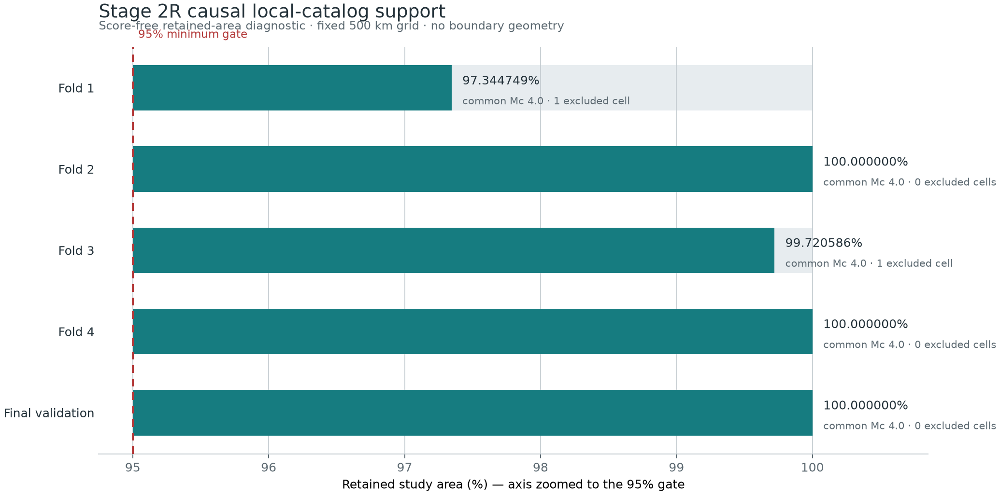

# 阶段2R局部支持域预登记协议

## 1. 身份与边界

- 实验版本：`0.2.1`
- 门控名称：`G1-LS`
- 父协议：`0.2.0`
- 父协议执行指纹：`f386f0d6abd5b7ca0e31e073ce0f74da812fb561052639d45227e8f339ff9032`
- 计划冻结标签：`v0.2.1-background-local-support-protocol`
- 已知前置事实：父协议在空间完整度门控失败；没有生成任何背景模型分数；锁定测试未运行。

本协议只修订空间目录完整度的处理方式。父协议的数据、时间、四个开发折、最终验证段、三类背景模型、随机性、数值回归、模型选择和G1信息增益要求继续适用。父协议结果不被覆盖或重新解释。

## 2. 冻结科学假设

局部目录不完整表示该固定空间格在对应历史截止时刻缺少可靠观测支持，不应自动抬高其他固定格的公共震级阈值。允许把该固定格标为无支持区，并在其余区域使用一个共同完整度震级比较全部模型。该做法只在保留绝大多数研究面积、严格保持因果时间截断且所有模型使用同一支持域时可评估。

不采用空间变化Mc观测模型作为本次修订。空间变化Mc需要同时重写检测概率、震级积分、ETAS父事件删失和点过程补偿，超出最小修复范围。

## 3. 支持域构造

每个快照独立执行：

1. 只读取研究区内、1970年以后、`origin_time_utc <= fit_end_utc` 且 `available_at <= fit_end_utc` 的地震。
2. 使用原点 `(0,0)` 固定的500 km等面积基础格；格边界与震中、目标和模型输出无关。
3. 基础格至少200个历史事件时，以该格0.1级分箱MAXC加固定0.2得到原始修正Mc。
4. 基础格不足200个事件时，继承固定1000 km父格的估计；父格仍不足200个事件时标为 `indeterminate`，保留并使用公共Mc。
5. 空间原始修正Mc高于4.0时，将对应500 km基础格标为 `unsupported`。时间块原始修正Mc高于4.0仍全实验失败。
6. 任一快照不存在合格时间层时，全实验硬失败；不得只依赖空间层继续运行。
7. 公共Mc为不低于所有合格时间层和受支持空间层估计的最小冻结候选，候选仍为 `{3.0,3.2,3.5,4.0}`。
8. 支持域面积使用原研究区与固定格的精确等面积裁剪计算。每个快照必须保留至少95%，边界值95%算通过。

支持域清单只能包含构造规则、输入哈希、快照截止、固定格身份、诊断估计、面积、公共Mc、b值和内容地址。公开清单中的固定格身份记录只保留固定格编号、行列号和精确裁剪面积；诊断记录只保留决策，不包含研究区边界、格网裁剪几何、经纬度坐标或WKB。禁止包含评估段目标计数或位置、任何模型分数、信息增益、命中结果、模型选择或 `Score ID`。

## 4. 模型共同支持

- 均匀Poisson：只用支持域内 `M>=Mc` 的历史事件，分母为支持域精确面积和时间暴露。
- 空间Poisson/KDE：混合中心只来自支持域训练事件；在支持域12.5 km求积上归一到1；三个网格继续做收敛审计。
- ETAS：目标、背景KDE和补偿积分只在支持域；原300 km外部父缓冲规则不变。无支持格内达到该格冻结局部Mc的已观测事件可作为条件父历史，但不得成为目标、背景训练事件或输出，并增加完全排除无支持格父事件的敏感性。
- 同一快照三模型必须共享 `support_id`、公共Mc、目标ID、有效面积和补偿几何；任一不一致都是硬失败。

## 5. G1-LS和防止缩域获利

G1-LS沿用父协议的连续时间点过程对数似然、每物理事件信息增益、四个开发折至少三个为正、最终验证为正和数值稳定性要求。不同快照可以有各自因果支持域，但同一快照的比较域必须完全相同。

模型选择的 `paired_difference` 只允许在同一快照、同一 `support_id`、同一公共Mc、同一目标集合、同一有效面积和同一补偿几何上逐目标配对计算；不得让不同模型各自缩域获利。

G1-LS只能支持“在局部可评估支持域内优于均匀基线”的结论。后续全研究区严格召回、Molchan曲线和报警面积效率仍以原研究区全部目标为主分母；落在无支持格的目标按未覆盖计算。另行报告的支持域条件指标不得替代主表。

## 6. 执行顺序与停止条件

1. 先实现支持域诊断、清单验证、精确面积和防泄漏测试。
2. 生成无评分支持域清单和诊断图。
3. 测试、验收、提交和推送后冻结预登记标签。
4. 标签之后才允许模型拟合和评分；不运行锁定测试。
5. 任一快照保留面积低于95%、时间Mc高于4.0、不存在合格时间层、共同支持不一致或G1-LS失败时，登记可信负结果并停止。

## 7. 冻结前无评分诊断

下图和表只使用各快照拟合截止时已经发生且已经可用的历史地震目录所生成的清单摘要，报告保留面积、公共Mc和排除格数量。图件与表格不包含研究区边界、格网裁剪几何或经纬度坐标，也不读取评估目标、验证目标、模型分数、信息增益、命中结果或模型选择。

| 快照 | 拟合截止（UTC） | 公共Mc | 无支持基础格 | 局部原始Mc | 保留面积 | `support_id` |
|---|---|---:|---|---:|---:|---|
| fold_1 | 2004-12-31 16:00 | 4.0 | `r+7/c-3` | 4.5 | 97.344749% | `local-support-f06e7c7496ea2357` |
| fold_2 | 2009-12-31 16:00 | 4.0 | 无 | — | 100.000000% | `local-support-eaee903b28c55ace` |
| fold_3 | 2014-12-31 16:00 | 4.0 | `r+6/c-5` | 4.1 | 99.720586% | `local-support-f86126dbec5bb79b` |
| fold_4 | 2019-12-31 16:00 | 4.0 | 无 | — | 100.000000% | `local-support-788851371baf0e3b` |
| final_validation | 2023-06-30 16:00 | 4.0 | 无 | — | 100.000000% | `local-support-f6816ab6c6581306` |

冻结清单为 `data/manifests/background_local_support_manifest.json`，清单内容地址为 `local-support-bundle-69cecbee9093a21d`，文件SHA-256为 `632278416dfc717dbcb9d2eae048a4f13cdf7737a31e6e5e704a9dd17d7cef8d`。清单可以由生成脚本逐字节重建；0.2.1正式配置会同时解析其严格结构、拒绝禁用结果字段、交叉核对源文件路径与哈希，并把该清单作为第八个封印输入。

阶段2R-0代码显式禁止0.2.1进入主背景流水线、Poisson/KDE流水线或ETAS流水线。只有本协议完成测试、验收、提交、推送并冻结标签后，阶段2R-1才可替换该禁令并实现支持域一致的模型拟合与评分。
