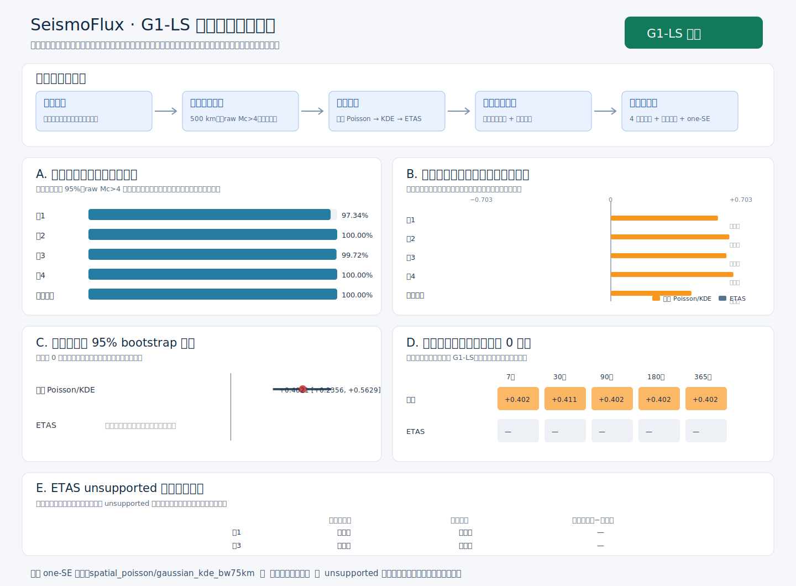

# SeismoFlux 背景局部支持域报告（G1-LS）

- 协议版本：`0.2.1`
- 结果状态：`completed`
- G1-LS：`通过`
- 阶段3允许：`true`
- Score Ledger：`score-ledger-0f5f2b21132dcee9`（440 个 Score ID）
- 锁定测试：未运行；锁定测试的 Score ID、产物 ID 为空，目标数为 null。

> 本报告中的数值是固定局部支持域内的条件强度和相对信息增益，不是绝对发震概率。

## 数据与支持域

| 快照 | 公共 Mc | 支持面积比例 | 支持面积（km²） | support_id |
| --- | ---: | ---: | ---: | --- |
| fold_1 | 4.0 | 97.345% | 9165305.8 | `local-support-f06e7c7496ea2357` |
| fold_2 | 4.0 | 100.000% | 9415305.8 | `local-support-eaee903b28c55ace` |
| fold_3 | 4.0 | 99.721% | 9388998.1 | `local-support-f86126dbec5bb79b` |
| fold_4 | 4.0 | 100.000% | 9415305.8 | `local-support-788851371baf0e3b` |
| final_validation | 4.0 | 100.000% | 9415305.8 | `local-support-f6816ab6c6581306` |

局部 `raw Mc > 4.0` 只把对应既有固定格标为 unsupported，不提高其他格的排除状态。达到冻结局部 Mc 的 unsupported 事件仅可作为 ETAS 条件父历史，并另报完全排除这些父事件的敏感性。

## 模型与判定

比较顺序为均匀 Poisson、支持域归一 KDE 和 ETAS；三者在每个快照共享目标事件、有效面积与补偿积分域。KDE 带宽与最终模型严格按冻结 one-SE 规则选择。

| 模型 | 最终验证 IG（nats/事件） | 正增益开发折 | G1-LS 同模型通过 |
| --- | ---: | ---: | --- |
| uniform_poisson | +0.00000 | 0 | false |
| spatial_poisson | +0.40215 | 4 | true |
| etas | — | 0 | false |

## 次级诊断与限制

7/30/90/180/365 天 × 0/1/7 天报告延迟只作支持域积分诊断，不参与 G1-LS。后续任何全研究区严格召回、Molchan 或报警面积主表必须仍以原研究区全部目标为分母，unsupported 区目标计为未覆盖。

## ETAS unsupported 父历史敏感性

这是条件父历史敏感性，不是把局部高 Mc 的空间排除传播到其他格。两列均相对同一均匀基线计算。

| 快照 | 状态 | 纳入合格 unsupported 父历史 IG | 完全排除 IG | 差值（排除−纳入） |
| --- | --- | ---: | ---: | ---: |
| fold_1 | not_evaluable | — | — | — |
| fold_3 | not_evaluable | — | — | — |

## 审计身份

- 授权 ID：`a7d0dc8f54643ec1c6cd3fd6425326a17ef8d7fb3071d6496adb73a9c9bc0f53`
- 执行封印：`3f8219ccc9ea68545f99e6d5bfb7cb0553ce6ce9340c10a8a8523fb0f51f08a4`
- 代码提交：`34fa7b4a491a062ff6e86daecf5568539661b42f`
- 评分代码标签：`v0.2.1-background-local-support-scoring-code-r1`
- 预留物理核心：至少 2 个
- 结果标签（提交结果后创建）：`v0.2.1-background-local-support-baselines`

